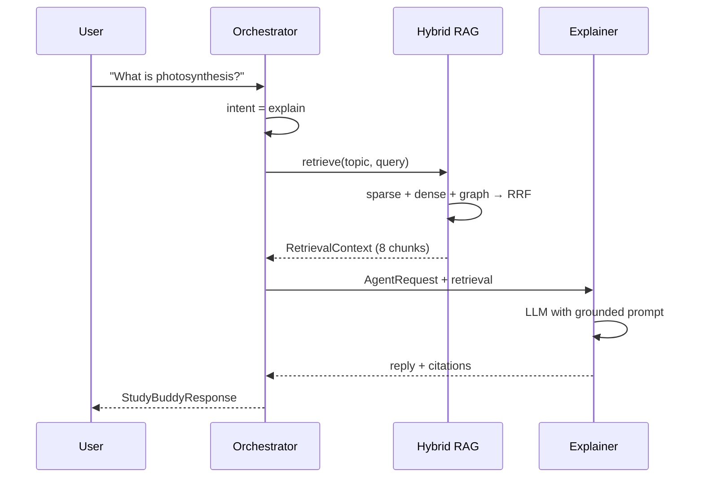
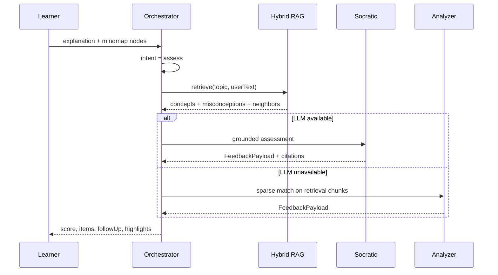
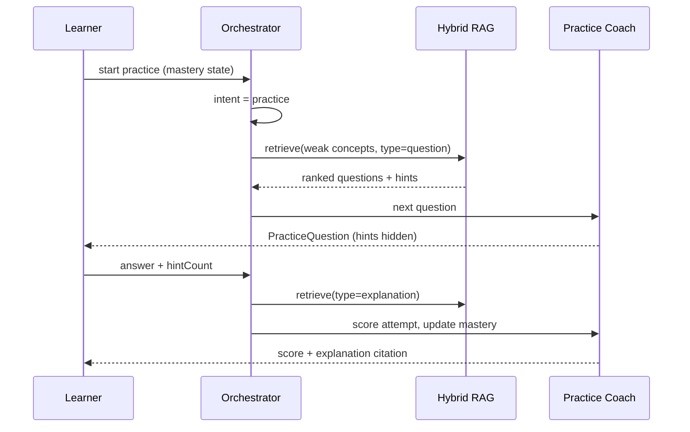

# Padhaaku Hybrid RAG — Unified Orchestration Plan

This document unifies the four Padhaaku agents (built across parallel Cursor branches) under a single **Hybrid RAG** architecture. Hybrid RAG combines **sparse** (keyword / structured), **dense** (vector semantic), and **graph** (concept relationships) retrieval, then fuses and reranks results before any agent generates a response.

---

## 1. The Four Agents (current state)

| # | Agent | Branch | Role | Retrieval today |
|---|-------|--------|------|-----------------|
| 1 | **Explainer** | `cursor/dev-environment-setup-f6ee` | Teaches topics via chat (`/api/chat`) | None — pure LLM or offline template |
| 2 | **Socratic Feedback** | `cursor/learning-canvas-a3cd` (`llm.mjs`) | Assesses learner explanations, returns structured JSON | None — LLM only |
| 3 | **Concept Analyzer** | `cursor/learning-canvas-a3cd` (`analyzer.mjs` + `concepts.mjs`) | Offline keyword/concept scoring, misconception detection | Sparse only — hardcoded `TOPICS` bank |
| 4 | **Practice Coach** | `cursor/recreate-fermi-expo-app-b6db` | Adaptive STEM practice, stepwise hints, mastery tracking | None — in-memory question bank |

**Problem:** Each agent works in isolation. Knowledge is duplicated (concepts in `concepts.mjs`, questions in Expo state, chat has no grounding). No shared retrieval layer.

**Goal:** One orchestrator, one knowledge index, four specialized agents that all consume fused retrieval context.

---

## 2. Target Architecture

```
┌─────────────────────────────────────────────────────────────────────────┐
│                         Padhaaku Orchestrator                           │
│  ┌──────────────┐  ┌──────────────┐  ┌──────────────┐  ┌──────────────┐  │
│  │   Router     │→ │ Hybrid RAG   │→ │  Reranker    │→ │   Agent      │  │
│  │ (intent)     │  │  Retriever   │  │  (fusion)    │  │  Dispatcher  │  │
│  └──────────────┘  └──────────────┘  └──────────────┘  └──────────────┘  │
└─────────────────────────────────────────────────────────────────────────┘
         │                    │                    │                │
         │                    │                    │                ├── Explainer
         │                    │                    │                ├── Socratic Feedback
         │                    │                    │                ├── Concept Analyzer
         │                    │                    │                └── Practice Coach
         │                    │                    │
         │            ┌───────┴───────┐            │
         │            ▼               ▼            │
         │     ┌────────────┐  ┌────────────┐     │
         │     │ Sparse     │  │ Dense      │     │
         │     │ (BM25 /    │  │ (vector    │     │
         │     │  keywords) │  │  embed)    │     │
         │     └────────────┘  └────────────┘     │
         │            │               │            │
         │            └───────┬───────┘            │
         │                    ▼                    │
         │            ┌────────────┐               │
         │            │ Graph      │               │
         │            │ (concept   │               │
         │            │  edges)    │               │
         │            └────────────┘               │
         │                    │                    │
         └────────────────────┴────────────────────┘
                              ▼
                    ┌──────────────────┐
                    │  Knowledge Store │
                    │  (unified index) │
                    └──────────────────┘
```

---

## 3. Hybrid RAG Retrieval Layer

### 3.1 Knowledge corpus (unified schema)

Migrate fragmented sources into one `KnowledgeChunk` model:

```typescript
type KnowledgeChunk = {
  id: string;
  topicId: string;           // e.g. "photosynthesis"
  type: "concept" | "misconception" | "model_answer" | "hint" | "question" | "explanation";
  text: string;
  keywords: string[];        // for sparse retrieval
  importance: number;        // 1–3, for analyzer weighting
  metadata: {
    label?: string;
    hint?: string;
    correction?: string;
    difficulty?: 1 | 2 | 3;
    subject?: string;
    prerequisites?: string[]; // topicIds for graph edges
  };
};
```

**Ingestion sources (phase 1):**

| Source | Branch file | Chunk types |
|--------|-------------|-------------|
| Concept bank | `server/concepts.mjs` → `TOPICS` | concept, misconception, model_answer |
| Practice bank | `App.tsx` → `practiceQuestions` | question, hint, explanation |
| Chat templates | `study-buddy.ts` → offline reply structure | explanation (seed) |

### 3.2 Three retrieval channels

| Channel | Technology | What it finds | Weight |
|---------|------------|---------------|--------|
| **Sparse** | BM25 / keyword overlap (`keywords[]`, aliases) | Exact concept hits, misconception phrases | 0.35 |
| **Dense** | Vector index (Pinecone integrated or local `all-MiniLM`) | Semantically similar explanations, paraphrases | 0.45 |
| **Graph** | Adjacency on `prerequisites` + mind-map `edges` | Related concepts, missing prerequisite nudges | 0.20 |

### 3.3 Fusion & reranking

1. Run all three retrievers in parallel for the query (topic + learner text + intent).
2. **Reciprocal Rank Fusion (RRF)** to merge ranked lists: `score(d) = Σ 1/(k + rank_i(d))` with `k=60`.
3. **Agent-specific rerank** (optional cross-encoder or LLM reranker) to top-8 chunks.
4. Pass `RetrievalContext` to the selected agent.

```typescript
type RetrievalContext = {
  topicId: string | null;
  topicLabel: string;
  chunks: KnowledgeChunk[];
  fusionScores: Record<string, number>;
  graphNeighbors: string[];  // related topicIds
};
```

---

## 4. Orchestrator — routing & dispatch

### 4.1 Intent router

| User signal | Route to | Example |
|-------------|----------|---------|
| `"What is X?"` / chat message | **Explainer** | Chat UI |
| Learner submits explanation (text/mindmap) | **Socratic Feedback** (+ Analyzer fallback) | Learning canvas |
| `"Quiz me"` / practice session | **Practice Coach** | Fermi mobile |
| Low LLM confidence or no API key | **Concept Analyzer** (local) | Automatic fallback |

Router can be rule-based initially; upgrade to a lightweight classifier later.

### 4.2 Agent contracts (uniform I/O)

Every agent receives the same `AgentRequest`:

```typescript
type AgentRequest = {
  intent: "explain" | "assess" | "practice" | "hint";
  topic: string;
  userText?: string;
  nodes?: MindNode[];
  history?: StudyMessage[];
  mastery?: Record<string, number>;  // for practice coach
  retrieval: RetrievalContext;
};
```

Every agent returns `AgentResponse`:

```typescript
type AgentResponse = {
  agent: "explainer" | "socratic" | "analyzer" | "coach";
  provider: "openai" | "anthropic" | "local" | "offline";
  payload: ExplainerPayload | FeedbackPayload | PracticePayload;
  citations: string[];  // chunk IDs used
};
```

### 4.3 Fallback chain (already proven in branches)

```
Socratic Feedback ──(LLM fail)──► Concept Analyzer ──(unknown topic)──► generic scaffolding
Explainer ──(no API key)──► offline template grounded in retrieved model_answer
Practice Coach ──(no backend)──► local question bank filtered by retrieval
```

---

## 5. Per-agent Hybrid RAG integration

### Agent 1: Explainer

**Today:** `getStudyBuddyReply()` → OpenAI or offline template.

**With Hybrid RAG:**

1. Retrieve top concepts + model_answer + related topics for the question.
2. Inject into system prompt:

   ```
   Ground your answer ONLY in these retrieved facts:
   [chunk texts with citations]
   If retrieval is empty, say you don't have enough material and ask a clarifying question.
   ```

3. Offline mode: assemble reply from retrieved `model_answer` + concept bullets instead of generic template.

**API:** `POST /api/chat` (unchanged contract, enriched internally).

---

### Agent 2: Socratic Feedback

**Today:** `analyzeWithLLM()` — full topic assessment via LLM, no grounding.

**With Hybrid RAG:**

1. Retrieve expected concepts, misconceptions, and model_answer for the topic.
2. Pass retrieval context in the user prompt (not just raw learner text).
3. Instruct LLM to reference `nodeId` / `span` against retrieved misconception patterns.
4. Reduces hallucinated "missing" items — aligns with concept bank.

**API:** `POST /api/feedback` (unchanged contract).

---

### Agent 3: Concept Analyzer

**Today:** `analyzeLocally()` — keyword match against `TOPICS`.

**With Hybrid RAG:**

1. Sparse channel *is* the analyzer's primary path — keep keyword logic.
2. Dense retrieval supplements unknown topics: find nearest known topic via embedding similarity.
3. If similarity > threshold (e.g. 0.82), borrow that topic's concept structure with a disclaimer.
4. Graph retrieval surfaces prerequisite gaps ("You mentioned X but not its prerequisite Y").

**API:** Internal fallback inside `/api/feedback`; also callable directly for offline-only mode.

---

### Agent 4: Practice Coach

**Today:** In-memory `practiceQuestions` + local mastery state in Expo.

**With Hybrid RAG:**

1. Retrieve questions/hints/explanations filtered by `topicId`, `difficulty`, and mastery gaps.
2. Rank questions where `concept.mastery < target` and retrieval importance is high.
3. Hints revealed stepwise from retrieved `hint` chunks (not hardcoded array index).
4. After each attempt, write back a `KnowledgeChunk` of type `learner_attempt` (future — enables spaced repetition retrieval).

**API:** New `POST /api/practice/next` and `POST /api/practice/attempt`.

---

## 6. Implementation phases

### Phase 0 — Unify codebase (prerequisite)

Merge the three feature branches into one monorepo layout:

```
padhaaku/
├── apps/
│   ├── web/          # Next.js (from dev-environment-setup)
│   ├── canvas/       # Vite learning canvas (from learning-canvas)
│   └── mobile/       # Expo Fermi (from recreate-fermi-expo-app)
├── packages/
│   ├── core/         # types, orchestrator, router
│   ├── rag/          # hybrid retriever, fusion, ingestion
│   └── agents/       # explainer, socratic, analyzer, coach
└── data/
    └── seed/         # concepts.json, questions.json (migrated from branches)
```

### Phase 1 — Knowledge ingestion + sparse retrieval

- [ ] Export `TOPICS` from `concepts.mjs` → `data/seed/concepts.json`
- [ ] Export `practiceQuestions` → `data/seed/questions.json`
- [ ] Implement `KnowledgeStore` with BM25 / keyword search
- [ ] Wire Concept Analyzer to `KnowledgeStore` (drop hardcoded import)
- [ ] **Deliverable:** Analyzer works identically but reads from unified store

### Phase 2 — Dense retrieval

- [ ] Embed all `KnowledgeChunk.text` (batch on deploy)
- [ ] Stand up vector index (Pinecone integrated index or local fallback with `@xenova/transformers`)
- [ ] Implement parallel sparse + dense retrieval with RRF fusion
- [ ] Wire Explainer to inject retrieval context into prompts
- [ ] **Deliverable:** Chat answers cite retrieved chunks; offline mode uses retrieved model answers

### Phase 3 — Graph retrieval + Socratic grounding

- [ ] Add `prerequisites` edges to concept seed data
- [ ] Implement graph expand (1-hop neighbors) during retrieval
- [ ] Wire Socratic Feedback to grounded assessment prompt
- [ ] Add `citations[]` to feedback response
- [ ] **Deliverable:** LLM feedback aligned with concept bank; fewer false "missing" flags

### Phase 4 — Practice Coach backend

- [ ] Implement `/api/practice/next` and `/api/practice/attempt`
- [ ] Connect Expo app to API (replace in-memory bank)
- [ ] Mastery-aware retrieval: boost chunks for weak concepts
- [ ] **Deliverable:** Mobile practice driven by same knowledge index

### Phase 5 — Orchestrator & observability

- [ ] Single `POST /api/orchestrate` entry (optional — or keep per-route with shared RAG middleware)
- [ ] Logging: retrieval hits, fusion scores, agent chosen, latency per channel
- [ ] Evaluation harness: golden questions → expected chunks retrieved → agent output quality
- [ ] **Deliverable:** One dashboard metric per agent + retrieval hit rate

---

## 7. API surface (unified)

| Endpoint | Agent(s) | Hybrid RAG |
|----------|----------|------------|
| `POST /api/chat` | Explainer | Retrieve concepts + model_answer |
| `POST /api/feedback` | Socratic → Analyzer fallback | Retrieve concepts + misconceptions + graph neighbors |
| `POST /api/practice/next` | Practice Coach | Retrieve questions + hints by mastery gap |
| `POST /api/practice/attempt` | Practice Coach | Retrieve explanation chunk for scoring |
| `GET /api/health` | — | Report RAG index status (chunk count, vector ready) |
| `POST /api/admin/reindex` | — | Re-embed after seed data changes (dev only) |

---

## 8. Environment variables

| Variable | Used by | Purpose |
|----------|---------|---------|
| `OPENAI_API_KEY` | Explainer, Socratic | LLM generation |
| `ANTHROPIC_API_KEY` | Socratic | Alternative LLM |
| `OPENAI_MODEL` | Both | Model override |
| `PINECONE_API_KEY` | Dense retrieval | Vector index (prod) |
| `PINECONE_INDEX` | Dense retrieval | Index name |
| `RAG_SPARSE_WEIGHT` | Fusion | Default 0.35 |
| `RAG_DENSE_WEIGHT` | Fusion | Default 0.45 |
| `RAG_GRAPH_WEIGHT` | Fusion | Default 0.20 |
| `RAG_TOP_K` | All agents | Chunks after rerank (default 8) |

---

## 9. Sequence diagrams

### Explain flow



### Assess flow (learning canvas)



### Practice flow



---

## 10. Success criteria

| Metric | Target |
|--------|--------|
| Retrieval hit rate (known topics) | ≥ 95% of queries return ≥ 3 relevant chunks |
| Analyzer parity | Same scores as legacy `analyzer.mjs` on golden set |
| Explainer grounding | 100% of citations map to real chunk IDs |
| Socratic alignment | ≤ 10% false "missing concept" on seeded topics |
| Practice coverage | Every seeded question retrievable by topic + difficulty |
| P95 latency (retrieval + agent) | < 2s local sparse; < 4s with dense + LLM |

---

## 11. Branch merge order

To avoid conflicts, merge in this sequence:

1. `cursor/dev-environment-setup-f6ee` → establishes Next.js + `packages/core` scaffold
2. `cursor/learning-canvas-a3cd` → port `concepts.mjs` / `analyzer.mjs` / `llm.mjs` into `packages/agents`
3. `cursor/recreate-fermi-expo-app-b6db` → move to `apps/mobile`, extract question bank to `data/seed`
4. **This branch** → add `packages/rag` + orchestrator per this plan

---

## 12. Immediate next steps

1. **Approve this plan** and pick vector backend (Pinecone vs local embeddings for MVP).
2. **Execute Phase 0** — monorepo merge from the three agent branches.
3. **Execute Phase 1** — seed JSON + sparse `KnowledgeStore` (no new infra required).
4. **Wire orchestrator middleware** into existing `/api/chat` and `/api/feedback` routes.
5. **Add evaluation fixtures** under `data/eval/` with golden retrieval + agent outputs.

The scaffold in `packages/core` and `packages/rag` (this branch) provides the TypeScript interfaces and orchestrator skeleton to begin Phase 1 without waiting for the full monorepo merge.
